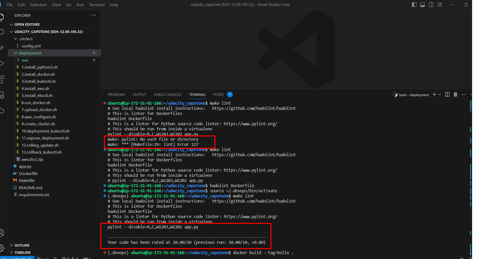
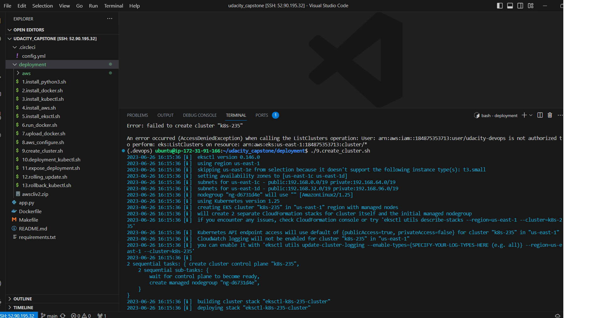
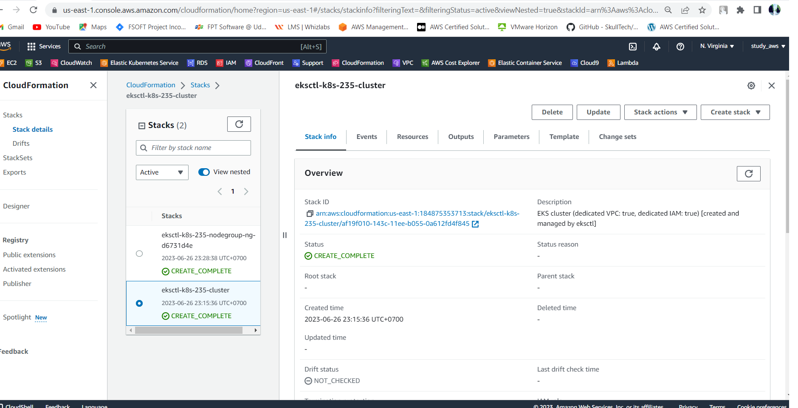
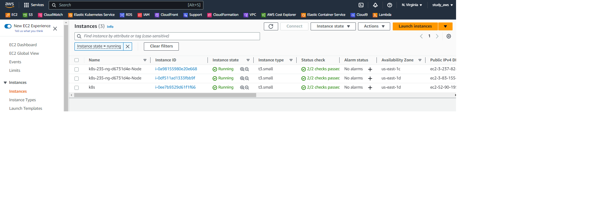
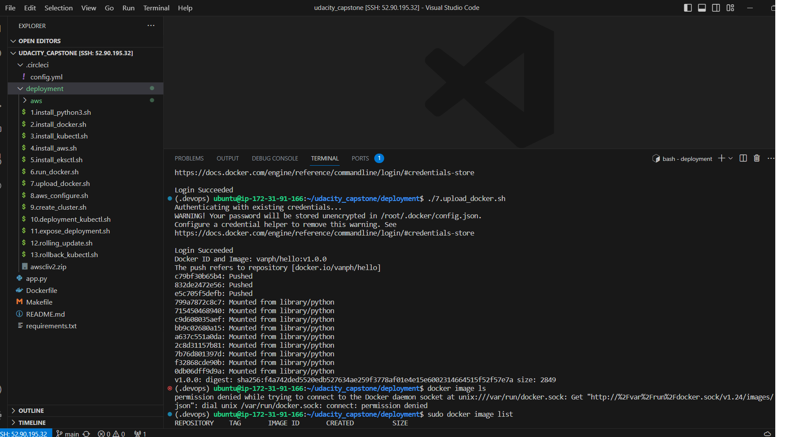

# Udacity AWS DevOps Engineer Capstone Project

## Project Overview

This capstone project showcases the use of several CI/CD tools and cloud services covered in the program [Udacity - AWS Cloud DevOps Engineer.](https://www.udacity.com/course/cloud-dev-ops-nanodegree--nd9991)

### Introduction

This project "operationalize" a sample python/[flask](https://flask.palletsprojects.com/)

## What does this project do?

- Create Github repository with project code
- Use image repository to store Docker images
- Execute linting step in code pipeline
- Build a Docker container in a pipeline
- The Docker container is deployed to a Kubernetes cluster
- Use a Rolling Deployment successfully

## Requirements
 - Python 3.7

## START HERE
Create EC2 for build enviroment

### Setup Enviroment
chmod +x 1.1.install_python3.sh
./1.1.install_python3.sh
chmod +x 2.install_docker.sh
./2.install_docker.sh
chmod +x 3.install_kubectl.sh
./3.install_kubectl.sh
chmod +x 4.install_aws.sh
./4.install_aws.sh
chmod +x 5.install_eksctl.sh
./5.install_eksctl.sh

chmod +x 9.create_cluster.sh
./9.create_cluster.sh

### Build Image and upload to docker hub
Reset passwd docker
- sudo passwd ubuntu
- sudo usermod -aG docker ${USER}
- su - ${USER}
chmod +x 6.run_docker.sh
./6.run_docker.sh

chmod +x 7.upload_docker.sh
./7.upload_docker.sh

Hello world application running:

Link
http://a1b4bd383a53b4e478c6d2d789984bda-1527648362.us-east-1.elb.amazonaws.com/